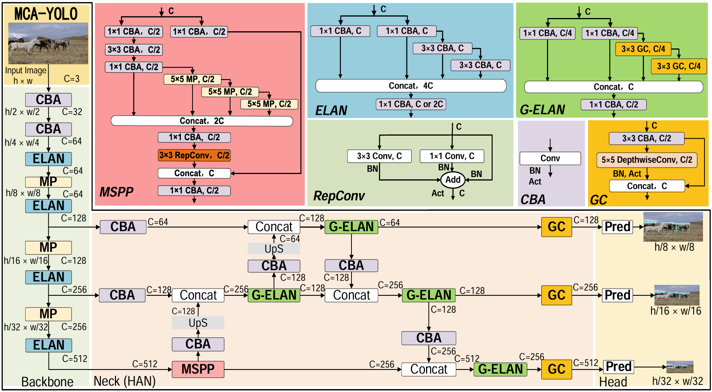
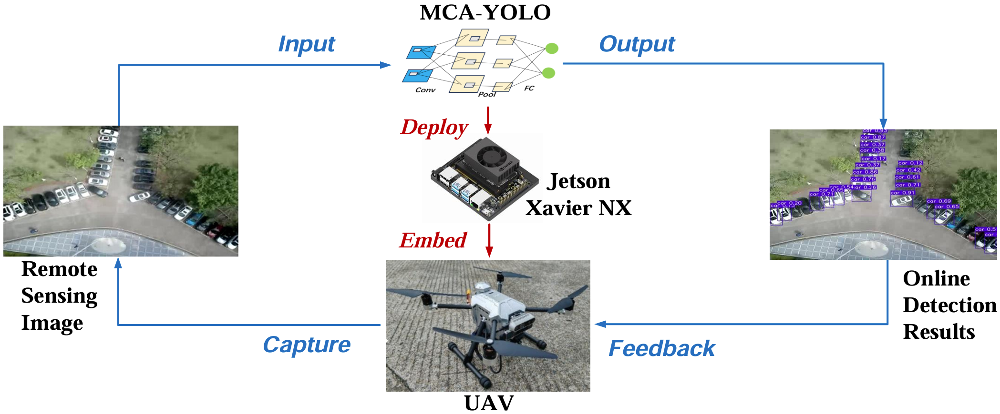
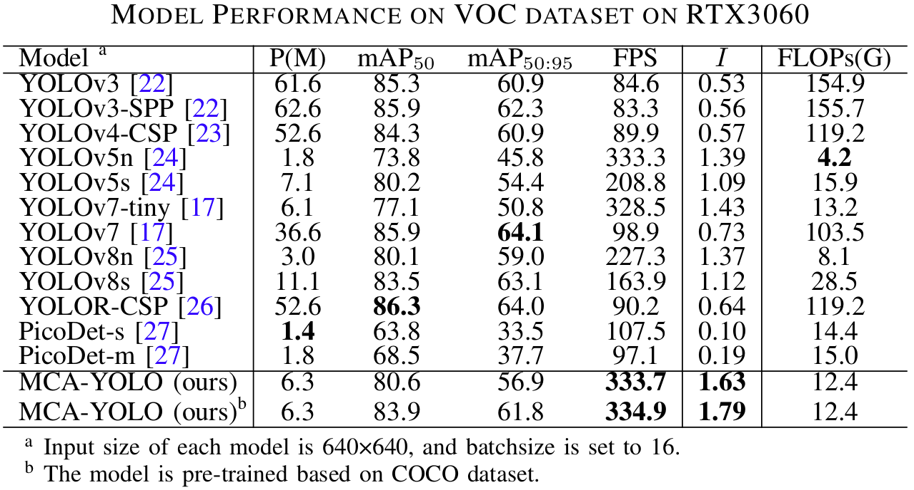
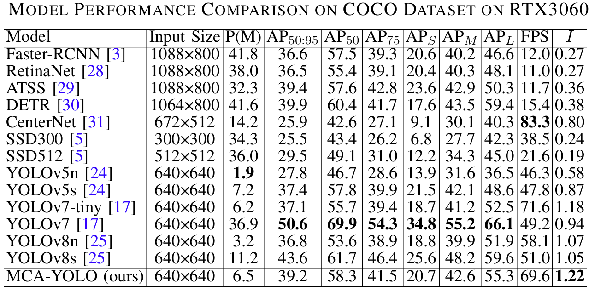
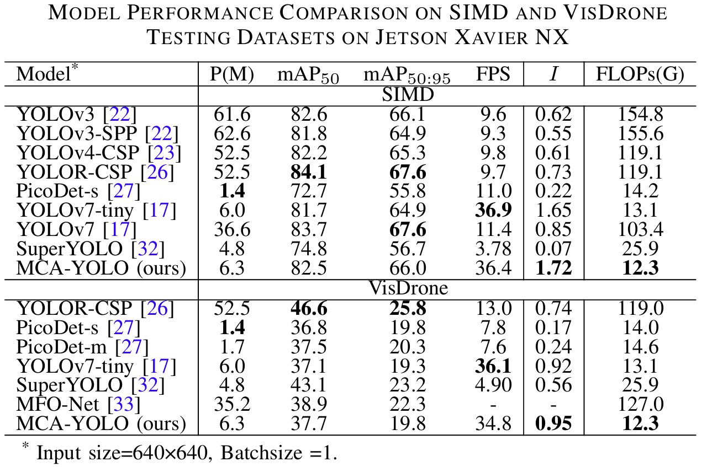

## MCA-YOLO: A Robust and Efficient Multi-Scenario Object Detection Network on Edge Devices
An elaborately designed MCA-YOLO model is proposed in this work, which features a novel neck structure, HAN, incorporating the MSPP, G-ELAN block, and GC module to enhance learning capability.


To establish a real-time intelligent object detection system for real-world applications, we deploy the trainedMCA-YOLO on a Jetson Xavier NX edge computer embedded in the Prometheus450 drone.


## Data
We validate its effectiveness on VOC, COCO, SIMD, and VisDrone datasets.
VOC:

COCO:

SIMD and VisDrone:



## Paper

https://ieeexplore.ieee.org/document/10843218


## Usage

Train:

```sh
python train.py --cfg cfg/mcayolo.yaml --data data/simd.yaml
```

Test:

```sh
python test.py --weights mcayolo_simd.pt --data data/simd.yaml
```

## Please cite our paper if it is useful for you. Thank you!
Z. Chen, A. Luo, L. Ding, J. Zheng and Z. Huang, "A Robust and Efficient Multiscenario Object Detection Network for Edge Devices," in IEEE Geoscience and Remote Sensing Letters, vol. 22, pp. 1-5, 2025, Art no. 6003205, doi: 10.1109/LGRS.2025.3529830.

```sh
@ARTICLE{10843218,
  author={Chen, Zhihuan and Luo, Aiwen and Ding, Lin and Zheng, Jialu and Huang, Zunkai},
  journal={IEEE Geoscience and Remote Sensing Letters}, 
  title={A Robust and Efficient Multiscenario Object Detection Network for Edge Devices}, 
  year={2025},
  volume={22},
  number={},
  pages={1-5},
  keywords={Convolution;Feature extraction;Accuracy;Autonomous aerial vehicles;Remote sensing;Neck;Kernel;Image edge detection;YOLO;Computational modeling;Edge device;lightweight neural network;object detection;unmanned aerial vehicle (UAV);YOLO},
  doi={10.1109/LGRS.2025.3529830}}
```


